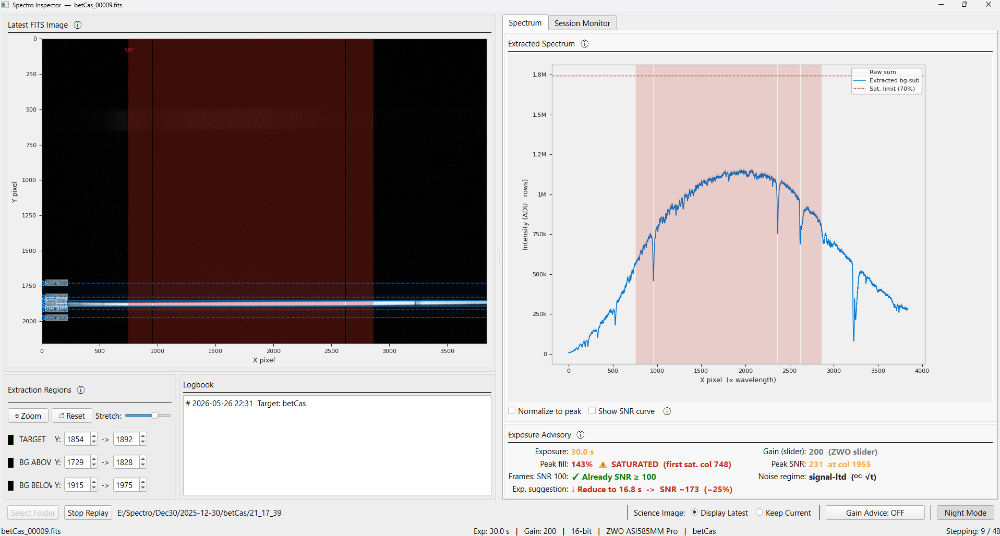
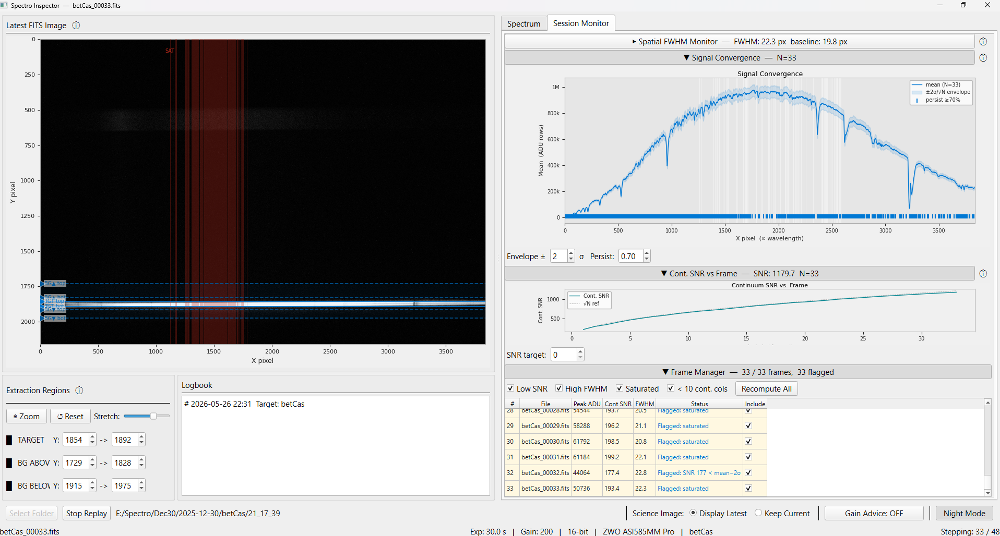
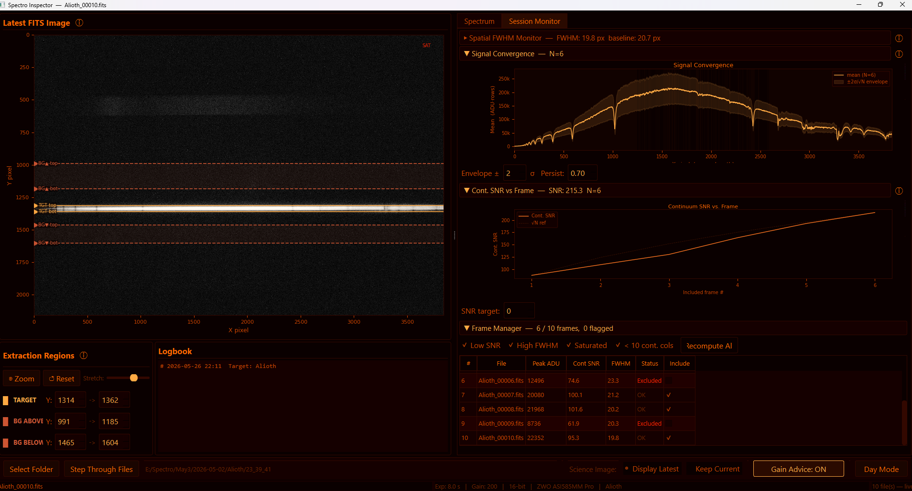
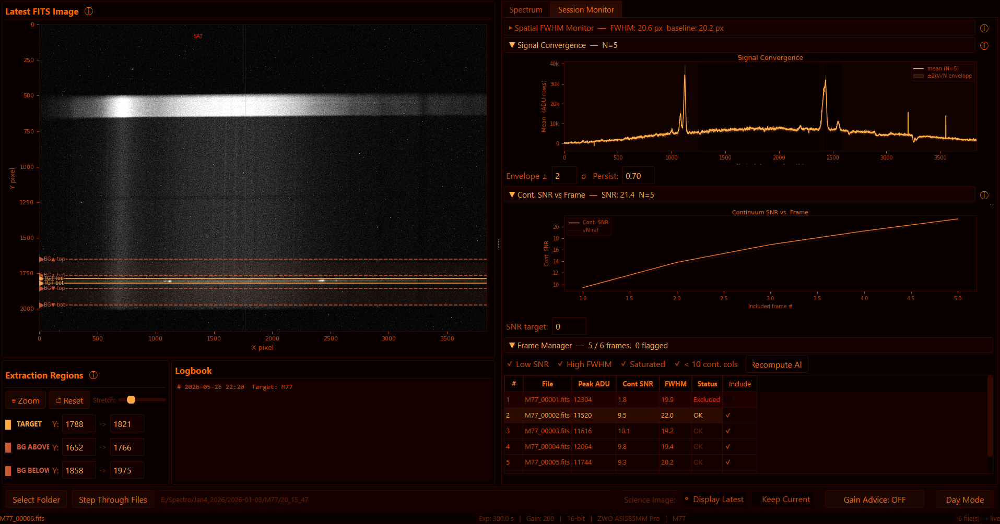

# Spectro Inspector

With great help from Claude, I wrote an inspector app for spectroscopy data acquisition. This app polls your FITS science image folder for new images (any app can take the images such as Sharpcap or NINA: but needs to have basic fits headers) and then runs stats. Your images will remain unaltered (and uncalibrated).  

Stats included in this release: Exposure Advisory; to help stay within the linear range of your CMOS sensor, FWHM on the width of the target (changing FWHM points to changing seeing or slit, guiding issues). There is a tab for Session stats - highlighting outlier subs, and showing how SNR improves towards your target SNR over time. 

Can be used for any slit (StarEx) or slitless (SA100, SA200) spectroscope setup. 

There is a night mode optimmized for using a red filter on your laptop screen. Day mode will be bright default color scheme. 


## Screenshots

| | |
|---|---|
|  |  |
| **Saturation detection (day mode)** — Red shading highlights saturated columns on both the 2D image and the extracted spectrum. The advisory panel reports the first saturated column and suggests a shorter exposure. | **Session Monitor tab (day mode)** — FWHM trend chart, Signal Convergence with ±σ envelope, SNR-vs-frame sparkline, and Frame Manager table with auto-flagged frames. |
|  |  |
| **Session Monitor in night-vision palette** — The full red-channel-only UI for use at the telescope. Signal Convergence, SNR sparkline, and Frame Manager shown across 10 frames. | **Night mode — M77** — Convergence chart showing persistent spectral features (coloured ticks below x-axis), 5 stacked frames with √N SNR growth tracked in the sparkline. |


## Requirements

- Python 3.11+
- `astropy`, `numpy`, `matplotlib`, `PyQt6`

## Installation

**Windows (recommended):**
```
install.bat
```
This creates a `.venv` virtual environment and installs all dependencies from `requirements.txt`.

**Manual:**
```
pip install -r requirements.txt
```

## Running

**Windows:**
```
run.bat
```
or double-click `run.bat`.

**Any platform:**
```
python spectro_tool.py
```

## Quick Start

1. Click **Select Folder** and point it at your FITS output directory.
   The tool loads the most recent file immediately and watches for new ones.

2. Drag the coloured handles on the image (or edit the spinboxes) to place the
   **TARGET** and background (**BG ABOVE / BG BELOW**) extraction bands over your star trace.

3. Read the **Exposure Advisory** panel:
   - **Peak fill** — how full the brightest pixel is relative to the saturation threshold
   - **Peak SNR** — signal-to-noise at the brightest wavelength column
   - **Frames: SNR 100** — how many stacked exposures are needed to reach SNR 100
   - **Noise regime** — tells you whether longer exposures or more frames helps most
   - **Exp. suggestion** — suggested exposure time to hit ~80% of the saturation threshold

4. Enable **Gain Advice** for a full ASI585MM Pro gain analysis (HCG mode awareness).

5. Use **⊕ Zoom Box** to draw a rectangle on the image and zoom in; the spectrum X-axis synchronises automatically. Click **↺ Reset View** to return to the full frame.

6. Switch to the **Session Monitor** tab to track multi-frame session quality.

## Session Monitor

Set the **Flatness threshold** (ADU/column) to control which wavelength columns are considered flat continuum (free of strong spectral lines). Default 500 ADU/col.

**▶ Spatial FWHM Monitor** — Tracks the stellar trace width (seeing) per frame using a Gaussian fit to the spatial profile of continuum columns. Baseline is set from the first reliable fits. Warn% and Alarm% thresholds trigger colour-coded alerts.

**▶ Signal Convergence Monitor** — Running mean spectrum with ±Nσ confidence envelope. Coloured ticks mark columns where a spectral feature persists across frames. The SNR sparkline shows actual vs ideal √N growth; three consecutive deviations trigger a transparency/guiding warning.

**▶ Frame Manager** — Every frame with its peak ADU, continuum SNR, FWHM, and inclusion status. Auto-flag rules: Low SNR, High FWHM, Saturated, < 10 continuum columns. Uncheck **Include** to exclude a frame; click **Recompute All** to replay Welford statistics.

## Logbook

A notepad in the lower-left panel. When a FITS file with an `OBJECT` header keyword is loaded, the logbook automatically opens or creates `logbook_<Target>.txt` in the watch folder. Notes are auto-saved 5 seconds after each keystroke and flushed on close.

## Camera Notes — ZWO ASI 585MM Pro

The camera has a 12-bit native ADC but writes 16-bit FITS files (raw pixel value × 16).

Conversion gain used for SNR calculations (e⁻ per 16-bit FITS ADU):

| Gain slider | e⁻/ADU | Read noise | Full well |
|-------------|--------|------------|-----------|
| 0           | 0.594  | 6.5 e⁻    | 40 000 e⁻ |
| 50          | 0.344  | 5.5 e⁻    | 22 000 e⁻ |
| 100         | 0.188  | 4.7 e⁻    | 11 000 e⁻ |
| 150         | 0.113  | 4.1 e⁻    |  6 000 e⁻ |
| 195         | 0.063  | 4.0 e⁻    |  4 000 e⁻ |
| **200 (HCG)** | 0.047 | **1.0 e⁻** | 2 500 e⁻ |
| 250         | 0.022  | 0.8 e⁻    |  1 500 e⁻ |
| 300         | 0.011  | 0.7 e⁻    |  1 000 e⁻ |

HCG mode activates at gain slider ≥ 200. Read noise drops from ~4 e⁻ to ~1 e⁻ — a 4× improvement — at the cost of a smaller full well.

Gain and read-noise values are looked up automatically from the FITS `GAIN` header keyword.

## Configuration

Settings are saved automatically to `spectro_config.json` in the same folder (excluded from version control). Key fields:

| Key | Default | Description |
|-----|---------|-------------|
| `saturation_threshold` | 0.70 | Fraction of full ADU range treated as saturated |
| `target_fill` | 0.80 | Desired fill fraction for exposure suggestions |
| `poll_interval_ms` | 2000 | Folder polling interval (ms) |
| `flatness_threshold` | 500.0 | Derivative threshold for continuum column detection |

## License

MIT — see [LICENSE](LICENSE).
