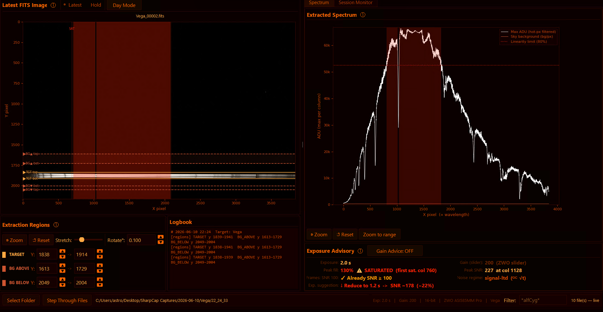
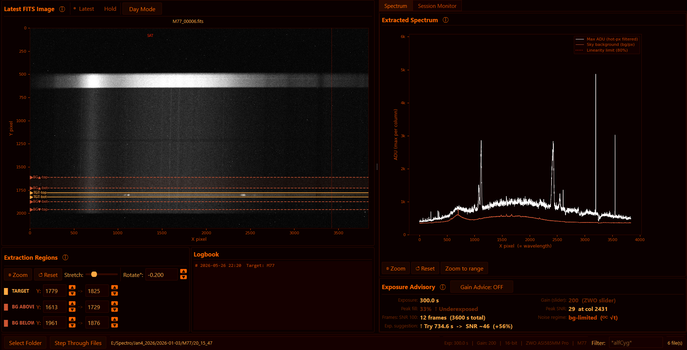
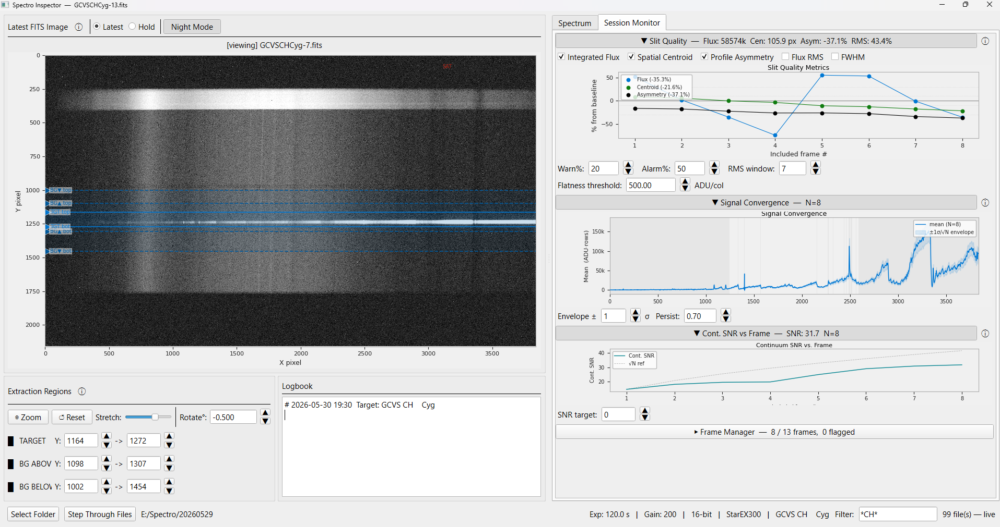
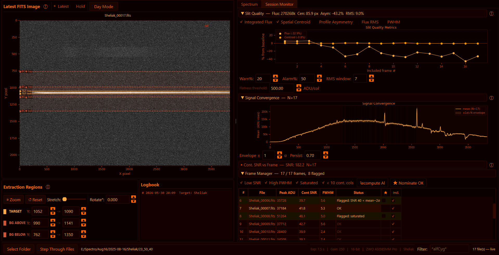

# Spectro Inspector

Spectro Inspector is a real-time quality control and session monitoring tool for astronomical spectroscopy acquisition.

A common challenge is to find the right exposure time/gain for spectroscopic images. Too short will result in poor SNR. Too long will risk non-linearity or even saturation - hence incorrect data.

The app continuously watches your FITS science image folder for new exposures — compatible with acquisition software such as SharpCap or N.I.N.A. (requires basic FITS headers only). Your original science frames remain completely untouched and uncalibrated.

## Screenshots

| | |
|---|---|
|  |  |
| **Exposure Advisory — saturated (night mode)** — Night-vision view of a heavily over-exposed stellar spectrum. The red-shaded region in the Extracted Spectrum panel marks columns exceeding the 80 % linearity limit; here saturation covers nearly the full wavelength range. The Exposure Advisory reports the saturation state and suggests a corrected exposure time. | **M77 galaxy spectrum (day mode)** — 29 accumulated frames of M77 viewed in day mode. The spectrum chart shows the galaxy continuum, and the Exposure Advisory reports the multi-frame SNR and an updated exposure suggestion. The watch folder path and frame counter are visible in the bottom bar. |
|  |  |
| **Slit Quality Metrics (day mode)** — Session Monitor tab with the Slit Quality panel expanded. Four metrics on a shared % from baseline y-axis: Integrated Flux (orange), Spatial Centroid Y, Profile Asymmetry, and Flux RMS rolling window. The Signal Convergence chart below shows the running mean spectrum with ±1 σ/√N envelope and the SNR sparkline. | **Session Monitor + Frame Manager (night mode)** — Full night-vision view of the Session Monitor tab. The Frame Manager table lists every frame with Peak ADU, Continuum SNR, FWHM, and Status; flagged frames are highlighted. The ★ Nominate OK button and sortable column headers are visible at the top. |

## Features

### Acquisition Control
- **Filename Filter** — glob pattern filter box (e.g. `*alfCyg*`) limits which files the watcher picks up; live `N/T file(s)` counter shows matched vs total FITS in the folder
- **Step Through Files** — replay all existing frames one by one before switching to live polling, rebuilding session statistics from scratch
- **Image Rotation** — ±5° correction spinbox aligns a tilted spectral trace with the horizontal extraction bands; uses bicubic spline interpolation (scipy `order=3, reflect`) so downstream row indices stay valid
- **Zoom** — rubber-band zoom on the 2D image; spectrum x-axis synchronises automatically

### Exposure Advisory
- **Peak fill** — how full the brightest target pixel is relative to the saturation threshold
- **Peak SNR** — signal-to-noise ratio at the brightest wavelength column
- **Frames: SNR 100** — estimated stacked frames needed to reach SNR 100 (√N scaling)
- **Noise regime** — background-limited, read-noise-limited, or signal-limited diagnosis
- **Exp. suggestion** — target exposure time to reach ~80 % of the saturation threshold
- **Gain Advice** (toggle) — full ASI585MM Pro analysis: HCG mode detection, read noise, full-well, and gain change recommendation

### Spectrum View
- **White line** — hot-pixel-filtered peak ADU per column: 2nd-highest pixel value across TARGET rows, so a single hot pixel cannot distort the reading
- **Amber line** — sky background level per column from the BG regions (sigma-clipped mean)
- **Dashed red line + red shading** — linearity limit at 80 % of the full ADU range; shaded columns exceed it
- Y-axis fixed 0 → full sensor range (65 535 for 16-bit) — available headroom is visible at a glance
- **Zoom to range** button sets the Y scale so the spectrum peak sits at 80 % of visible height; zoom settings persist across file loads

### Slit Quality Metrics (Session Monitor)
Replaces the former FWHM-only chart with a four-metric panel, all on a shared **% deviation from session baseline** y-axis. Toggle each metric independently:

| Metric | Colour | Description |
|---|---|---|
| Integrated Flux | ACCENT (orange) | Total ADU summed across the 1D spectrum per frame. Primary throughput indicator — a sustained drop means the star is walking toward a slit jaw. |
| Spatial Centroid Y | OK_COL | Flux-weighted centre of the stellar profile in the cross-dispersion direction. Drift → star moving across the slit. |
| Profile Asymmetry | TEXT_HI | Flux imbalance above vs below the centroid (%). Non-zero → star clipped by one slit edge. Combined with falling flux this is the clearest early slit-loss warning. |
| Flux RMS | WARN (red) | Rolling standard deviation of Integrated Flux over the last N frames, normalised to session mean. Spikes near a slit edge as seeing fluctuations are amplitude-modulated by the slit transmission function. |
| FWHM (optional) | TEXT_DIM | Gaussian spatial profile width — seeing/focus indicator, not a centering metric. Warn% and Alarm% threshold lines apply when enabled. |

Reference lines at 0 %, ±10 %, ±30 % are drawn at low opacity. The collapsible header summarises all four primary metrics from the latest frame.

### Signal Convergence Monitor
- Running mean spectrum with ±N σ/√N confidence envelope (envelope width configurable)
- Persistence score: coloured ticks below the x-axis mark columns where a spectral feature recurs above a threshold fraction of frames
- Continuum SNR sparkline vs. frame number with an ideal √N reference; three consecutive deviations below it trigger a transparency/guiding warning

### Frame Manager
- Table of all frames: peak ADU, continuum SNR, FWHM, status
- **Sortable columns** — click any header to cycle default → ▲ ascending → ▼ descending (numeric sort; Status sorts OK / Flagged / Excluded)
- Auto-flag rules: Low SNR, High FWHM, Saturated, < 10 continuum columns; thresholds configurable
- **Include** checkbox to exclude individual frames from Welford session statistics; **Recompute All** replays stats
- **★ Nominate OK** — auto-selects all unflagged frames into the ★ column; you can manually toggle individual checkboxes, then click **Copy ► \\nominated** to copy those files to a `nominated/` sub-folder
- **Double-click a row** to switch to Hold display mode and load that frame for inspection; new live frames do not change the displayed image until you click **Latest**

### Logbook
- Notepad text area auto-linked to `logbook_<Target>.txt` in the watch folder (from FITS `OBJECT` header)
- Notes auto-saved 5 s after each keystroke and flushed on close
- **Region settings auto-appended** — whenever you move the TARGET or background bands, the Y-ranges are written to the logbook after a 2-second debounce so they can be referenced later

### Night / Day Theme
- **Night mode** — red-channel-only palette for use through a red astronomy filter
- **Day mode** — standard bright interface; toggle button sits in the image section header

## Requirements

- Python 3.11+
- `astropy`, `numpy`, `matplotlib`, `PyQt6`, `scipy`

## Installation

**Windows (recommended):**
```
install.bat
```
This creates a `.venv` virtual environment and installs all dependencies from `requirements.txt`.

**Manual:**
```
pip install -r requirements.txt
```

## Running

**Windows:**
```
run.bat
```
or double-click `run.bat`.

**Any platform:**
```
python spectro_tool.py
```

## Quick Start

1. Click **Select Folder** and point it at your FITS output directory.
   The tool loads the most recent file immediately and watches for new ones.

2. Optionally enter a **Filter** pattern (e.g. `*alfCyg*`) to restrict which files are picked up. The `N/T file(s)` counter updates in real time.

3. Drag the coloured handles on the image (or edit the spinboxes) to place the
   **TARGET** and background (**BG ABOVE / BG BELOW**) extraction bands over your star trace.

4. If the spectral trace is not perfectly horizontal, use the **Rotate°** spinbox to correct the tilt. The rotation is applied in memory — raw files are never modified.

5. Read the **Exposure Advisory** panel:
   - **Peak fill** — how full the brightest pixel is relative to the saturation threshold
   - **Peak SNR** — signal-to-noise at the brightest wavelength column
   - **Frames: SNR 100** — how many stacked exposures are needed to reach SNR 100
   - **Noise regime** — tells you whether longer exposures or more frames helps most
   - **Exp. suggestion** — suggested exposure time to hit ~80 % of the saturation threshold

6. Enable **Gain Advice** (button in the Exposure Advisory header) for a full ASI585MM Pro gain analysis.

7. Use **⊕ Zoom** (above the image or below the spectrum chart) to draw a rubber-band rectangle and zoom in; both canvases synchronise on the X-axis. Click **↺ Reset** to return to the full frame. Use **Zoom to range** below the spectrum to scale the Y-axis so the peak sits at 80 % of height.

8. Switch to the **Session Monitor** tab to track multi-frame session quality. Expand the **Slit Quality Metrics** panel to monitor flux, centroid, asymmetry, and RMS stability in real time.

9. In the **Frame Manager**, double-click any row to hold and inspect that frame. Use **★ Nominate OK** to collect clean frames and copy them to a `nominated/` subfolder.

## Session Monitor

Set the **Flatness threshold** (ADU/column) to control which wavelength columns are considered flat continuum (free of strong spectral lines). Default 500 ADU/col.

**▶ Slit Quality Metrics** — Four metrics on a shared % from baseline y-axis: Integrated Flux, Spatial Centroid Y, Profile Asymmetry, and Flux RMS (rolling window, configurable). FWHM is available as an optional fifth metric. Baseline is the mean of the first 5 included frames with a valid value for each metric. Toggle checkboxes to show/hide individual metrics.

**▶ Signal Convergence Monitor** — Running mean spectrum with ±Nσ confidence envelope. Coloured ticks mark columns where a spectral feature persists across frames. The SNR sparkline shows actual vs ideal √N growth; three consecutive deviations trigger a transparency/guiding warning.

**▶ Frame Manager** — Every frame with its peak ADU, continuum SNR, FWHM, and inclusion status. Click column headers to sort. Auto-flag rules: Low SNR, High FWHM, Saturated, < 10 continuum columns. Double-click a row to inspect that frame in Hold mode. Use **★ Nominate OK** to select and export clean frames to a `nominated/` sub-folder.

## Logbook

A notepad in the lower-left panel. When a FITS file with an `OBJECT` header keyword is loaded, the logbook automatically opens or creates `logbook_<Target>.txt` in the watch folder. Notes are auto-saved 5 seconds after each keystroke and flushed on close. Whenever extraction region boundaries change, the current TARGET and BG Y-ranges are automatically appended as a timestamped line.

## Camera Notes — ZWO ASI 585MM Pro

The camera has a 12-bit native ADC but writes 16-bit FITS files (raw pixel value × 16).

Conversion gain used for SNR calculations (e⁻ per 16-bit FITS ADU):

| Gain slider | e⁻/ADU | Read noise | Full well |
|-------------|--------|------------|-----------|
| 0           | 0.594  | 6.5 e⁻    | 40 000 e⁻ |
| 50          | 0.344  | 5.5 e⁻    | 22 000 e⁻ |
| 100         | 0.188  | 4.7 e⁻    | 11 000 e⁻ |
| 150         | 0.113  | 4.1 e⁻    |  6 000 e⁻ |
| 195         | 0.063  | 4.0 e⁻    |  4 000 e⁻ |
| **200 (HCG)** | 0.047 | **1.0 e⁻** | 2 500 e⁻ |
| 250         | 0.022  | 0.8 e⁻    |  1 500 e⁻ |
| 300         | 0.011  | 0.7 e⁻    |  1 000 e⁻ |

HCG mode activates at gain slider ≥ 200. Read noise drops from ~4 e⁻ to ~1 e⁻ — a 4× improvement — at the cost of a smaller full well.

Gain and read-noise values are looked up automatically from the FITS `GAIN` header keyword.

## Configuration

Settings are saved automatically to `spectro_config.json` in the same folder (excluded from version control). Key fields:

| Key | Default | Description |
|-----|---------|-------------|
| `saturation_threshold` | 0.70 | Fraction of full ADU range treated as saturated |
| `target_fill` | 0.80 | Desired fill fraction for exposure suggestions |
| `poll_interval_ms` | 2000 | Folder polling interval (ms) |
| `flatness_threshold` | 500.0 | Derivative threshold for continuum column detection |
| `file_filter` | `""` | Filename glob filter (e.g. `*alfCyg*`); empty = all files |
| `rotation_angle` | 0.0 | Image rotation in degrees (±5°) |
| `envelope_sigma` | 1.0 | Convergence envelope width in σ/√N units |
| `persistence_threshold` | 0.70 | Fraction of frames a feature must appear in to be marked |

## License

MIT — see [LICENSE](LICENSE).
